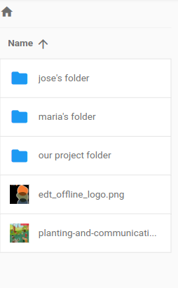

# Almacenamiento local

La herramienta Offline Toolkit proporciona un espacio de almacenamiento para los datos de la comunidad. Aparte del administrador, todo el contenido es público.

El primer paso es crear una cuenta nueva para ti. Deberás memorizar tu nombre y contraseña.

&#x20;

<figure><figcaption></figcaption></figure>

Una vez que hayas iniciado sesión tendrás acceso al espacio público para almacenar archivos. Crea una carpeta personal o de equipo y almacena tus archivos dentro.

<figure><figcaption></figcaption></figure>

Ten en cuenta el espacio de almacenamiento ya que hay límites en cuanto a cuánto puede contener el dispositivo. Consulta [managing-device.md](../../managing-device.md "mencionado") para aprender cómo verificar el espacio de almacenamiento.