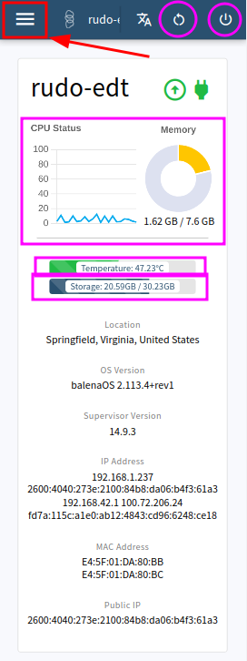

# Customizing experience

> ⚠️ Attention! The administration interface can only work while the device is connected to the internet for now.

The adminstration interface there's a configurations page that can be used to customize the Offline Toolkit. That page is usually found at: [http://edt.local:8079/#/configuration](http://edt.local:8079/#/configuration)

On the initial page there's several information on the devices's usage: processing, memory, storage as well as other importante information such as cpu temperature. Select the menu to explore other functionality.

<figure><figcaption></figcaption></figure>

In order to customize the device, enter the **Configuration** page:

<figure><figcaption></figcaption></figure>

On that page you can change the Environment Varibles for customization.

<figure><figcaption></figcaption></figure>

For example, the base maps for Terrastories,and the Observations Map can be changed by changing the `OFFLINE_MAP_STYLE` variable:

<figure><figcaption></figcaption></figure>

The device's default `edt.local` adress can be changed by changing the hostname:

<figure><figcaption></figcaption></figure>

The device's will now be acessible via `http://mygroup.local`

When changing hostname other variables need to changed to reflect the new addresss: `SET_HOSTNAME, HOST_HOSTNAME, OFFLINE_MAP_STYLE`

By setting values to specific variables we can change some behaviors, such as:

* Change WiFi SSID (hotspot name): `PWC_HOTSPOT_SSID`
* Change WiFi password: `PWC_HOTSPOT_PASSWORD`
* Change device's address: `SET_HOSTNAME`
* Change default username for Filebrowser and Syncthing: `ADMIN_LOGIN`
* Change default password for Filebrowser and Syncthing: `ADMIN_PASSWORD`
* Change project key for Mapeo: `MAPEO_PROJECT_KEY`
* Change Mapeo category that Terrastories place's will be collected from: `MAPEO_TERRASTORIES_TYPE`
* Should be set according to `SET_HOSTNAME` in order for Terrastories to work properly: `HOST_HOSTNAME`
* The offline map that Terrastories will use: `OFFLINE_MAP_STYLE`

### Syncing content

**Sync source**

The source Syncthing instance that the device will sync from

* SYNC\_SOURCE\_ID
* SYNC\_SOURCE\_NAME

**Crawled websites**

* SYNC\_CRAWLS\_ID
* SYNC\_CRAWLS\_NAME

**Mapeo configurations**

* SYNC\_MAPEO\_ID
* SYNC\_MAPEO\_NAME

**Map tiles**

* SYNC\_TILES\_ID
* SYNC\_TILES\_NAME

**F-Droid repository**

* SYNC\_FDROID\_ID
* SYNC\_FDROID\_NAME

**Application installers**

* SYNC\_INSTALLERS\_ID
* SYNC\_INSTALLERS\_NAME
