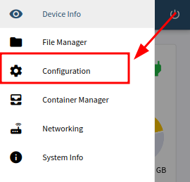
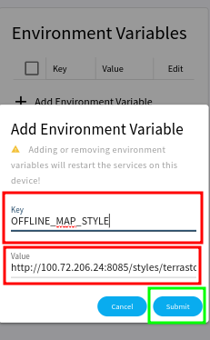

# Personalización de la experiencia

> ⚠️ ¡Atención! La interfaz de administración solo puede funcionar mientras el dispositivo esté conectado a internet por ahora.

En la interfaz de administración hay una página de configuraciones que se puede utilizar para personalizar la herramienta sin conexión. Esa página se encuentra generalmente en: [http://edt.local:8079/#/configuration] (http://edt.local:8079/#/configuration)

En la página inicial hay varias informaciones sobre el uso del dispositivo: procesamiento, memoria, almacenamiento, así como otras informaciones importantes como la temperatura de la CPU. Seleccione el menú para explorar otras funcionalidades.

<figure><figcaption> </figcaption> </figure>

Para personalizar el dispositivo, ingrese a la página ** Configuración **:

<figure><figcaption></figcaption></figure>

En esa página puede cambiar las Variables de entorno para personalización.

<figure><figcaption></figcaption></figure>

Por ejemplo, los mapas base para Terrastories y el Mapa de Observaciones se pueden cambiar cambiando la variable `OFFLINE_MAP_STYLE`:

<figure><figcaption></figcaption></figure>

La dirección predeterminada `edt.local` del dispositivo se puede cambiar cambiando el nombre de host:

<figure><figcaption></figcaption></figure>

El dispositivo ahora será accesible a través de `http://mygroup.local`

Al cambiar el nombre de host, otras variables necesitan cambiar para reflejar la nueva dirección: `SET_HOSTNAME, HOST_HOSTNAME, OFFLINE_MAP_STYLE`

Al establecer valores para variables específicas, podemos cambiar algunos comportamientos, como:

  * Cambiar SSID de WiFi (nombre del hotspot): `PWC_HOTSPOT_SSID`
  * Cambiar contraseña de WiFi: `PWC_HOTSPOT_PASSWORD`
  * Cambiar la dirección del dispositivo: `SET_HOSTNAME`
  * Cambiar el nombre de usuario predeterminado para Filebrowser y Syncthing: `ADMIN_LOGIN`
  * Cambiar la contraseña predeterminada para Filebrowser y Syncthing: `ADMIN_PASSWORD` ".* Cambiar la clave de proyecto para Mapeo: `MAPEO_PROJECT_KEY`
* Cambiar la categoría de Mapeo de donde se recogerán los lugares de Terrastories: `MAPEO_TERRASTORIES_TYPE`
* Debería ser configurado de acuerdo a `SET_HOSTNAME` para que Terrastories funcione correctamente: `HOST_HOSTNAME`
* El mapa offline que usará Terrastories: `OFFLINE_MAP_STYLE`

### Sincronización de contenido

**Fuente de sincronización**

La instancia Syncthing fuente a la que el dispositivo sincronizará

* SYNC\_SOURCE\_ID
* SYNC\_SOURCE\_NAME

**Sitios web rastreados**

* SYNC\_CRAWLS\_ID
* SYNC\_CRAWLS\_NAME

**Configuraciones de Mapeo**

* SYNC\_MAPEO\_ID
* SYNC\_MAPEO\_NAME

**Mapas de teselas**

* SYNC\_TILES\_ID
* SYNC\_TILES\_NAME

**Repositorio F-Droid**

* SYNC\_FDROID\_ID
* SYNC\_FDROID\_NAME

**Instaladores de aplicación**

* SYNC\_INSTALLERS\_ID
* SYNC\_INSTALLERS\_NAME"