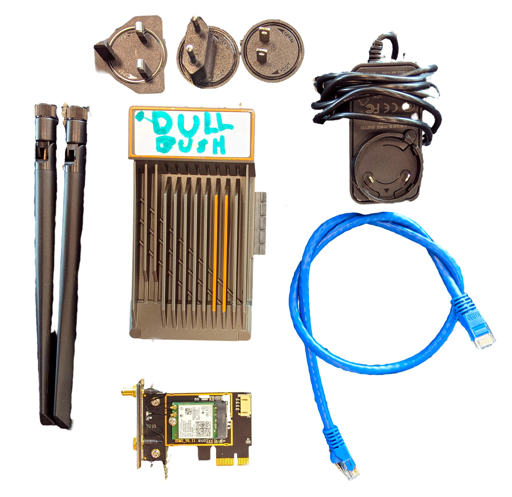
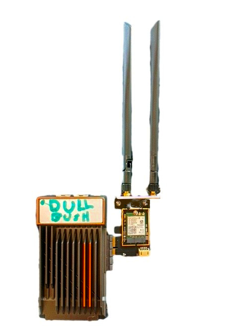
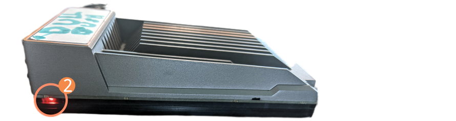

# Primeiros passos

<figure><figcaption>
Exemplo de equipamentos necessários para configurar um dispositivo usando o computador Zimaboard
</figcaption></figure>

Certifique-se de ter um dispositivo que foi configurado previamente com o Earth Defenders Offline Toolkit.&#x20;

Se o seu dispositivo tiver um cartão WiFi externo, conecte o cartão ao dispositivo antes de ligá-lo. Se houver antenas externas, certifique-se de conectá-las.

<figure><figcaption>
Computador Zimboard com cartão WiFi conectado
</figcaption></figure>

Conecte o dispositivo à fonte de alimentação e verifique se o dispositivo está ligado verificando se as luzes estão acesas. Se houver um cartão WiFi externo, ele também deve ligar.

<figure><figcaption>
Zimaboard visto de lado
</figcaption></figure>

Após alguns minutos, verifique se o ponto de acesso WiFi aparece nos dispositivos do usuário. Conecte-se ao ponto de acesso e abra o portal cativo (para desktops, o portal cativo pode não ser exibido).

Por fim, com o portal aberto, copie a URL fornecida, abra seu navegador preferido, cole a URL e carregue a página. Você está pronto para começar a explorar.

Se algum conteúdo não estiver aparecendo, pode ser que o seu dispositivo ainda não tenha sincronizado o conteúdo. Para sincronizar o conteúdo com o Earth Defenders Toolkit Cloud, você deve primeiro conectar o dispositivo à Internet e, em seguida, entrar em contato conosco para obter autorização.

Para obter instruções detalhadas, consulte o manual:&#x20;



Continue com os guias sobre:

* [connecting-to-the-internet.md](connecting-to-the-internet.md "menção")
* [syncing-content.md](syncing-content.md "menção")
* [exploring-content.md](exploring-content.md "menção")".