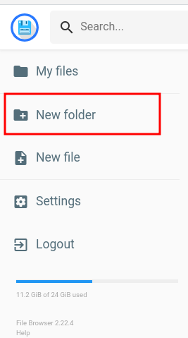

# Customizing synced content

### 1. Web scrapping

The scrapping of websites is done by [browsertrix-crawler](https://github.com/webrecorder/browsertrix-crawler) command-line. Find more instructions in the [crawling documentation](https://www.notion.so/Web-Crawling-c8f980b0fac54cdc9c2d9a308461ddd9).

Some experimentation is needed to find best practices on how to get exactly the amount of pages we want scraped, and for each language.

The scrapping might take a long time. Use the output warcz files on the next step.

### 2. Upload to the Cloud

Navigate to the [FileBrowser service](https://files.earthdefenderstoolkit.com) on the EDT cloud.

<figure><figcaption></figcaption></figure>

There are different directories within the `content` directory, each for a content type: F-Droid repository data; Desktop installers; Mapeo data (configs and tiles); and Offline Websites.

Create a new folder for your new content if needed:

Make sure there’s enough left storage on the server, and to upload new content simply drag to the folder or use the upload icon to select the file from your computer:

<figure><figcaption></figcaption></figure>

Once the new content is uploaded we can sync it to EDT devices.

### 3. Sync it

Navigate to the [Syncthing service](http://sync.earthdefenderstoolkit.com/) on the EDT cloud.

Now let’s add the folder that was uploaded on the previous step:

<figure><figcaption></figcaption></figure>

Add a descriptive label to the new folder. We’ve been using a pattern where the data type comes first, and a short title for it later.

The content directory is named `/data` directory here, so from find your folder under it.

<figure><figcaption></figcaption></figure>

Before clicking save, go to the **Advanced** tab. It’s worth changing the **Folder Type** to **Send Only** as most times we want a single source of truth for the content

Finally we can click save.

### 4. Adding to device

The first time a device is connected it’ll send a request to Earth Defenders Toolkit Cloud to start syncing content. Get the id from the the local Offline Toolkit Syncthing instance:

<figure><figcaption></figcaption></figure>

On the EDT Cloud instance search for that ID:

<figure><figcaption></figcaption></figure>

Give the new device a descriptive name, and got to the **Sharing** page:

<figure><figcaption></figcaption></figure>

On the **Sharing** page select all the folders that are relevant for the new device, usually the defautls:

<figure><figcaption></figcaption></figure>

On EDT Cloud you should see that the device is starting to sync:

<figure><figcaption></figcaption></figure>

On the local Offline Toolkit you should also see syncing happening with more details such as download rate, and amount synced so far.

<figure><figcaption></figcaption></figure>

You're done. Now every time the Cloud updates the content folder, the Offline Toolkit devices will automatically sync whenever they're online.
